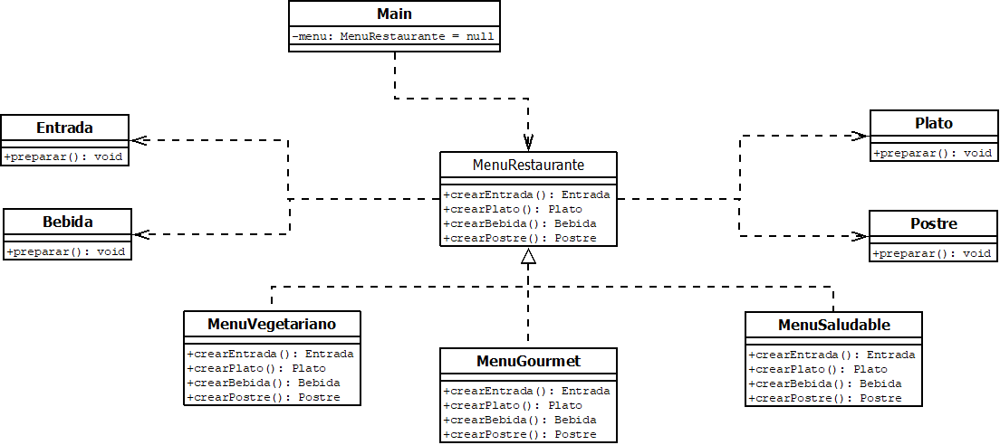

# 🏭 Ejercicio Factory Method

## Modelos de Programación

**Estudiante:** Juan Sebastián Gutiérrez Cuadros\
**Código:** 20232020146\
**Universidad:** Universidad Distrital Francisco José de Caldas

------------------------------------------------------------------------

## 📖 Descripción del Ejercicio

Este proyecto implementa el patrón de diseño **Factory Method**,
aplicado a la creación de diferentes tipos de menús en un restaurante.

El sistema permite seleccionar un tipo de menú:

-   Menú Vegetariano\
-   Menú Gourmet\
-   Menú Saludable

Cada menú crea una familia de productos compuesta por:

-   Entrada\
-   Plato fuerte\
-   Bebida\
-   Postre

El objetivo es desacoplar la creación de objetos del código cliente,
permitiendo trabajar contra abstracciones y facilitando la
extensibilidad del sistema.

------------------------------------------------------------------------

## 🏗 Patrón Implementado: Factory Method

El patrón **Factory Method** define una interfaz para crear objetos,
pero permite que las subclases decidan qué clase concreta instanciar.

En este ejercicio:

-   `MenuRestaurante` actúa como la fábrica abstracta.
-   `MenuVegetariano`, `MenuGourmet` y `MenuSaludable` son fábricas
    concretas.
-   `Entrada`, `Plato`, `Bebida` y `Postre` son productos abstractos.
-   `Main` cumple el rol de cliente.

------------------------------------------------------------------------

## 📊 Diagrama UML

Agregar aquí la imagen del diagrama UML en el repositorio con el nombre:

FactoryMethodUML.png

Y referenciarla así en GitHub:

------------------------------------------------------------------------

## 🔎 Estructura del Proyecto

MenuRestaurante (abstract) │ ├── MenuVegetariano ├── MenuGourmet └──
MenuSaludable │ ├── Entrada ├── Plato ├── Bebida └── Postre │ └── Main
(Cliente)

------------------------------------------------------------------------

## 🚀 Funcionamiento

1.  El usuario selecciona el tipo de menú.
2.  Se instancia la fábrica concreta correspondiente.
3.  La fábrica crea los productos del menú.
4.  Se ejecuta el método `preparar()` de cada producto.
5.  El usuario puede repetir el proceso.

------------------------------------------------------------------------

## 🎯 Principios Aplicados

-   Programación orientada a objetos.
-   Polimorfismo.
-   Bajo acoplamiento.
-   Principio de inversión de dependencias.
-   Encapsulamiento de la creación de objetos.

------------------------------------------------------------------------

## 📌 Conclusión

La implementación del patrón Factory Method permite:

-   Separar la lógica de creación de objetos.
-   Facilitar la extensión del sistema.
-   Reducir el acoplamiento entre clases.
-   Mejorar la mantenibilidad del código.

------------------------------------------------------------------------

© 2024\
Universidad Distrital Francisco José de Caldas
